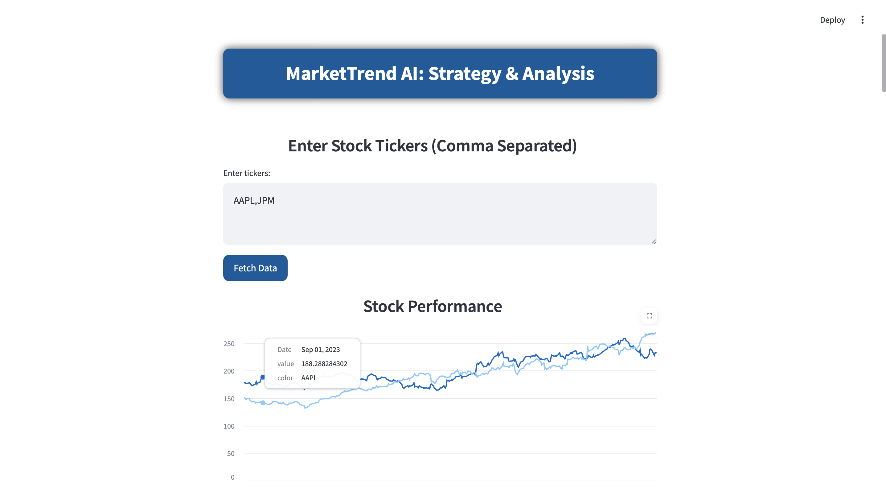
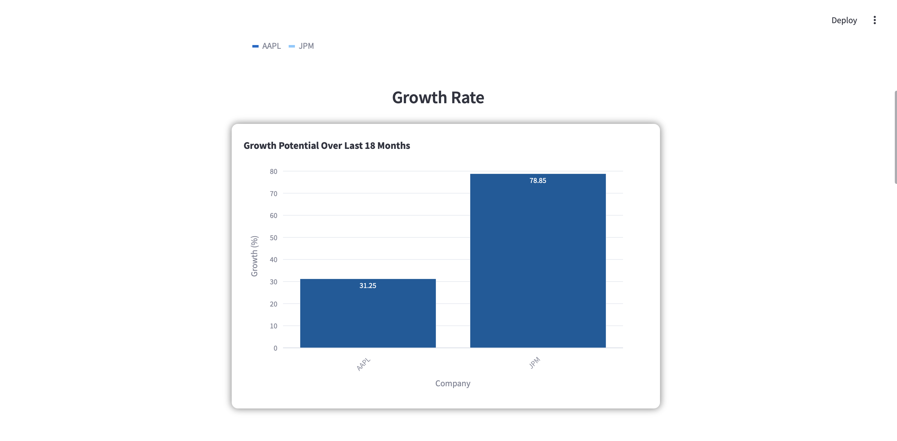
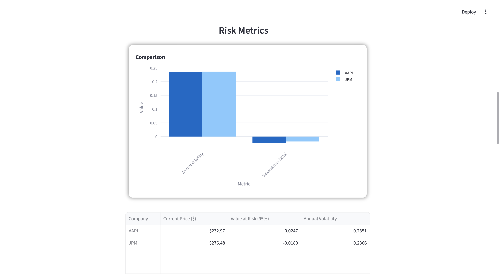
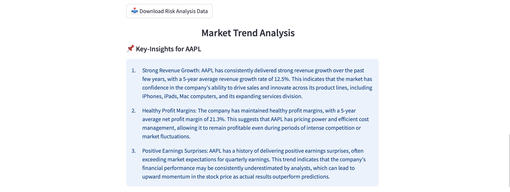

# MarketTrend AI: Strategy & Analysis

**MarketTrend AI** is a fintech-grade market analysis and forecasting tool designed to assist consultants in making strategic market expansion and investment decisions.

Contributed to a market expansion project for [Blackmont Consulting](https://www.blackmontconsulting.com), collaborating with a 5-member team by developing a market analysis software framework. The software supported the team by generating competitor analysis, market insights, and growth forecasts. Leveraged Cohere AI for predictive stock forecasting and Yahoo Finance API for real-time data. The project enhanced financial analysis and investment strategy development through AI-driven risk assessment and growth predictions.

## Features
1. AI-Driven Growth Forecasting: Provides 6-month & 12-month growth predictions for selected stocks.
2. Risk Metrics Calculation: Computes Volatility & Value at Risk (95%) for stocks.
3. Market Sentiment Insights: AI-driven extraction of stock-related news insights for trend and sentiment analysis.
4. Real-Time Market Data: Uses Yahoo Finance API for historical and live stock data.
5. Advanced Visualization: Plotly-based interactive charts for risk & performance analysis.
6. Scalable: Handles large datasets efficiently using NumPy, Pandas & Flask API.

## Requirements

- `Python 3.x`
- [Conda Environment](https://docs.conda.io/projects/conda/en/latest/user-guide/tasks/manage-environments.html)
- `streamlit`
- `numpy`
- `plotly`
- `pandas`
- `requests`
- `yfinance`
- `cohere`


## Installation

1. Clone the repository:
    ```
    git clone <https://github.com/Shiv716/MarketTrend_AI.git>
    ```
2. Navigate to the project directory:
    ```
    cd MarketDir
    ```
3. Build the Conda Environment
   ```
    conda create --name name_your_environment python=3.8
    ```
4. Activate the environment
     ```
    conda activate name_your_environment
    ```
5. Install the required packages:
    ```
    pip install flask streamlit yfinance numpy pandas plotly requests cohere
    ```

## Usage

**Note: The project leverages Cohere API by default for AI-driven insights. If a different AI engine is to be used, the relevant configurations should be updated accordingly.**

This project requires **two terminals** to be running simultaneously: -

Set the API-key & Set the environment variable in **both terminals**:
 ```
    export COHERE_API_KEY="your-cohere-key-here"
 ```

In **Terminal-1**, Run Flask API:
 ```
    python MarketAnalysis.py
 ```
In **Terminal-2**, Run Streamlit UI:
 ```
    streamlit run MarketTrend_AI.py
 ```

## Dashboard Features
<p align="center">
    
    
    
    
    
</p>

## Sample Reports
1. [Technology sector specific](https://shiv716.github.io/MarketTrend_Reports/Tech_Report.pdf)
2. [Finance sector specific](https://shiv716.github.io/MarketTrend_Reports/Finance_Report.pdf)
